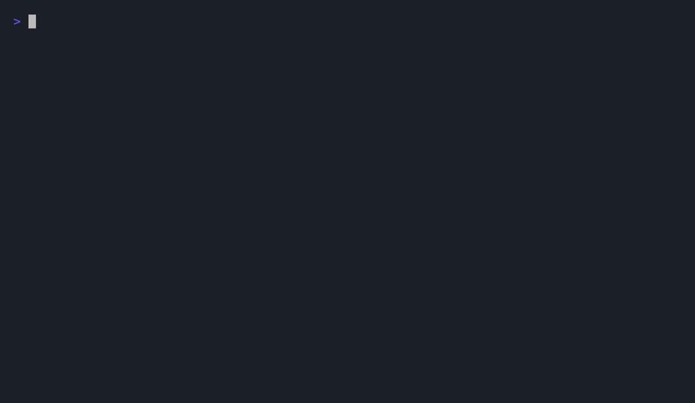

# Selfsame

[](https://github.com/PraveenKPandu/Selfsame/actions/workflows/ci.yml)
[](https://pypi.org/project/selfsame/)
[](https://pypi.org/project/selfsame/)
[](LICENSE)

**Know whether your code still behaves the same — before, after, and across every AI edit.**

Selfsame is a sound behavior checker for Python. It captures the *real* arguments your
tests (or app) feed your code, replays two versions in isolated subprocesses, and compares
the results structurally. Use it to prove a refactor didn't change behavior — or to catch
the silent regressions that creep in when an AI agent ships features all day and "a new
feature works, but the old ones quietly broke."



*Tests pass — but a "harmless" refactor silently changed `apply_discount(250, 33)` from
`167.50` to `167.49`. `selfsame drift` catches it. (Reproduce: [`demo/`](demo/).)*

> ### The one promise: **zero false confidence**
> Selfsame never says `equivalent` when behavior actually differs, and never says
> `divergent` when it doesn't. When it can't be sure, it **refuses** (`unverifiable`)
> instead of guessing. A green result means green.

- 🧪 **Inputs are real, not generated** — recorded from your own test suite or app run. No type hints required; methods, packages, and relative imports just work.
- 🔒 **Sound by construction** — uncontrolled I/O, threads, nondeterminism, and opaque values are refused, never certified.
- 🤖 **Built for AI-driven development** — freeze an accepted build, then measure how far each generated change drifts from it. No second git branch needed.
- 🎯 **Proves assumptions are load-bearing** *(experimental)* — `adjudicate` violates a nominated dependency boundary and shows whether the passing result secretly depended on it. A judge, not a guesser.
- 📄 **Agent-consumable reports** — every run drops `.selfsame/report.json` + Markdown with `file:line`, before→after witnesses, and what was *not* covered.
- 🪶 **Pure standard library** — no runtime dependencies. `pip install` and go.

---

## Install

**Python** (reference implementation):

```bash
pip install selfsame        # or: pipx install selfsame · uv tool install selfsame
```

Installs the `selfsame` command (`probe` is a kept alias). Python 3.8+.

**JavaScript / TypeScript** *(alpha)*:

```bash
npm install -g selfsame@next        # alpha is published under the `next` tag
```

Provides the `selfsame` command for JS/TS projects (`verify` / `snapshot` / `drift`). Node 18+.
See [packages/node](packages/node/) for what's supported. Other languages: the
[language roadmap](docs/languages.md).

## 60-second start

**Did my refactor change behavior?** (inputs come from your existing tests)

```bash
selfsame verify --base main --modules mypkg -- pytest -q
```

```
  parse_args                     n=11   equivalent
X slugify                        n=102  divergent     @ input #0
      input : ('Café', max_length=3)
      base  : 'caf'
      head  : 'caf-'
      minimized: ('ab', max_length=1)

Sound auto-verify : 3/4 = 100%
  ** 1 DIVERGENCE(S): behavior changed at a tested input **
selfsame: 3 equivalent · 1 divergent · 0 unverifiable  →  .selfsame/report.json
```

Exit code is non-zero on any divergence, so drop it straight into CI.

## The AI use case: catch regressions against a confirmed build

When an AI agent generates code continuously, you rarely have a clean "before" branch —
you have a build **you accepted** and **whatever the next feature did to it**. Freeze the
accepted behavior once, then check drift after every change:

```bash
# 1. You confirm a build works. Freeze its behavior as the baseline.
selfsame snapshot --modules myapp -- pytest -q

# 2. The agent develops the next feature (adds code, edits existing code)...

# 3. How much of the accepted behavior changed?
selfsame drift          # exit 1 if anything deviated → blocks the bad build
```

A worked example — the agent adds a feature *and* accidentally breaks an existing function:

```
~ discount          n=2   interface-change   (added optional param 'currency' — back-compatible)
X greet             n=1   divergent          base 'Hello, Sam!'  →  head 'Hi, Sam'     ← regression caught
  total             n=1   equivalent         (rewritten as a loop — behavior preserved)
# new_helper: flagged separately as changed code with no test baseline
```

The signal scales with **behavior that actually changed**, not lines of code: brand-new
code has no baseline (no noise), behavior-preserving rewrites stay `equivalent`, and only
real deviations at tested inputs are flagged. Make it automatic — `pytest` becomes your
regression gate:

```ini
# pyproject.toml  ·  [tool.pytest.ini_options]  (or pytest.ini)
[pytest]
selfsame = true     # the plugin runs a compare-only drift check after the suite
```

The plugin is **compare-only**: it never re-baselines on its own, so a regression can't
silently become the new "correct" behavior — you bless a new baseline explicitly with
`selfsame snapshot`.

👉 Full walkthrough: **[docs/ai-workflows.md](docs/ai-workflows.md)**

## Commands at a glance

| command | what it does |
|---|---|
| `selfsame verify`   | replay base vs head on your test inputs; per-function verdict + CI exit code |
| `selfsame snapshot` | freeze the current (accepted) build's behavior to a baseline file |
| `selfsame drift`    | measure how much current code deviated from the baseline (no second branch) |
| `selfsame capture`  | record real call arguments from any test or app command |
| `selfsame replay`   | replay captured arguments across two git refs |
| `selfsame attach`   | dump captures from a running, hook-enabled process without stopping it |
| `selfsame check`    | generate inputs and check two files / git refs (for typed, pure functions) |
| `selfsame fuzz`     | *(experimental)* mutate real inputs to find divergences your tests miss |
| `selfsame adjudicate` | *(experimental)* prove whether a nominated assumption is load-bearing on passing code |

Full reference with every flag: **[docs/commands.md](docs/commands.md)**.

## Documentation

| | |
|---|---|
| 🚀 [Getting started](docs/getting-started.md) | install, your first verify, your first snapshot/drift |
| 🤖 [AI workflows](docs/ai-workflows.md) | snapshot/drift, the pytest plugin, agent reports, working at LLM velocity |
| 📖 [Command reference](docs/commands.md) | every command and flag |
| ⚙️ [Configuration](docs/configuration.md) | `[tool.selfsame]`, environment variables, exit codes |
| 🛠️ [How it works](docs/how-it-works.md) | capture → replay → compare, and the soundness model |
| 🧭 [Limitations](docs/limitations.md) | the honest boundaries — read before you rely on it |
| 📐 [Architecture & spec](docs/architecture.md) | the engineering contract — data formats, canonical schema, verdict model (for contributors) |

## Languages

Selfsame is a **protocol** with one reference implementation today. The
[Selfsame Protocol](SPEC/protocol.md) defines what every language must share so a verdict
means the same thing everywhere, and the [conformance suite](SPEC/conformance/) keeps
implementations honest.

| language | status | |
|---|---|---|
| Python | ✅ shipped (reference) | [`packages/python/`](packages/python/) · `pip install selfsame` |
| JavaScript / TypeScript | 🟢 alpha | [`packages/node/`](packages/node/) — `verify`/`snapshot`/`drift` + JSON report; passes conformance (CommonJS; ESM in progress) |
| Java (JVM) | 🟢 alpha | [`packages/java/`](packages/java/) — end-to-end `-javaagent` capture → replay (static methods); passes conformance |
| Go, Rust | ⏸️ held | until they can match the full sound guarantee — see the [roadmap](docs/languages.md) |

The guarantee is the gate: a language joins only when it can capture real inputs,
canonicalize by observable form, and control the clock/entropy (or soundly refuse what it
can't). See the [language roadmap](docs/languages.md).

## Project

- Contributing: [CONTRIBUTING.md](CONTRIBUTING.md) · Releasing: [RELEASING.md](RELEASING.md)
- Changelog: [CHANGELOG.md](CHANGELOG.md) · Security: [SECURITY.md](SECURITY.md)
- Design rationale & validation: [experiments/FINDINGS.md](experiments/FINDINGS.md)
- License: [MIT](LICENSE)
